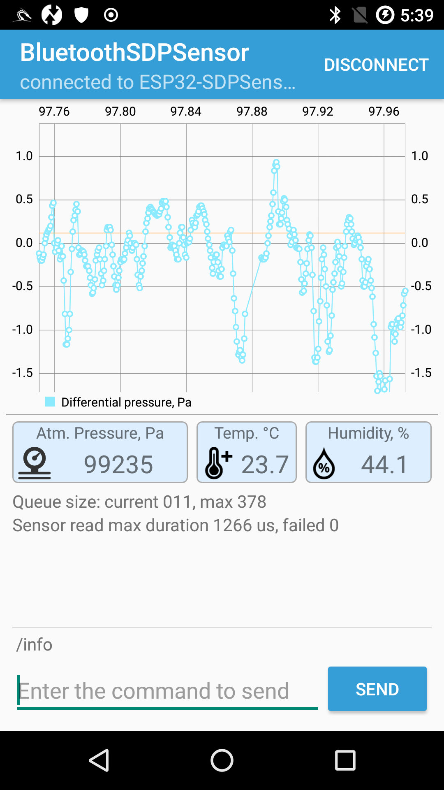

# Bluetooth Plotter

Android client app to plot Sensirion SDP Sensor data sent by an ESP32 board (the server). The server app is [here](https://github.com/dizcza/esp32-sdpsensor).

Based on the official [BluetoothChat](https://github.com/android/connectivity-samples/tree/master/BluetoothChat) Android app. Powered by the [MPAndroidChart](https://github.com/PhilJay/MPAndroidChart) plotting library.

## Screenshots
--------------

The plot below shows differential pressure sensor data read at the maximal ~1700 Hz frequency and sent over Bluetooth to the receiver (Android). The sensor used in the project is Sensirion SDP31 500 Pa.

